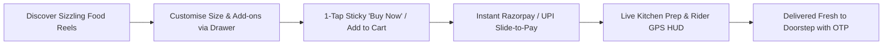
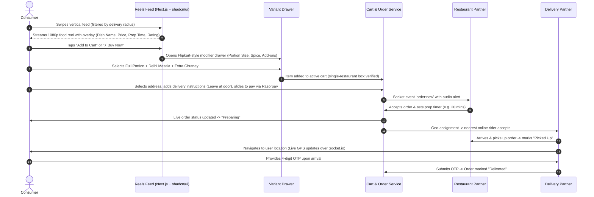
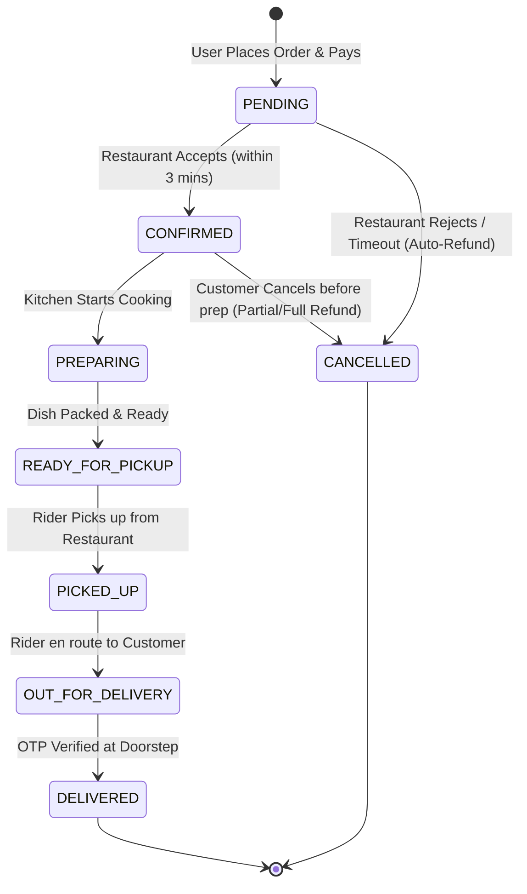

# 📄 Product Requirements Document (PRD) — Insta-Zomato

> **Project Name:** Insta-Zomato (Internal Codename: *BiteReels / Craver*)  
> **Status:** Approved / In Development  
> **Version:** 1.1.0  
> **UX Archetype:** Tri-Hybrid (**Zomato** Food Logistics + **Instagram** Reels Immersion + **Flipkart** E-Commerce Conversion)  
> **Tech Stack:** Node.js, Express.js v5, MongoDB, Redis, Socket.io, Cloudinary, Next.js 15 (App Router), shadcn/ui, Tailwind CSS  

---

## 1. Executive Summary & Vision

Traditional food delivery apps rely on static images and text menus, creating decision fatigue and low emotional appetite. Short-form video platforms (Instagram Reels, TikTok) trigger massive food cravings, but suffer from high friction: users cannot order the dish directly without searching third-party apps, only to find the dish out of stock or outside their delivery radius.

**Insta-Zomato** bridges this gap by creating an **instant visual food commerce platform**. It seamlessly integrates:
1. **Instagram Reels Immersion:** Ultra-fluid, full-screen vertical video feed of sizzling dishes, food prep, and chef specials.
2. **Zomato Delivery Mastery:** Live kitchen prep status, real-time rider GPS tracking, dietary indicators (Veg/Non-Veg), delivery instructions, and doorstep OTP verification.
3. **Flipkart High-Conversion E-Commerce:** 1-Tap Slide-to-Pay checkout, bottom-sheet dish variant & add-on customizers, flash deal countdowns, and itemized bill accordions.

---

## 2. Problem Statement & Value Proposition

### 2.1 The Problem
1. **Static Menu Fatigue:** Text descriptions and stock photos fail to trigger genuine appetite and emotional connection.
2. **Disconnected Food Discovery:** Users crave viral dishes seen on social media but cannot locate the exact restaurant delivering them locally.
3. **Low Restaurant Conversion:** Restaurants spend heavily on marketing videos with zero direct trackable return-on-investment (ROI) from video view to completed order.

### 2.2 The Solution & Value Proposition
- **For Consumers:** Immersive visual discovery where every video is 100% orderable from verified restaurants within their delivery radius.
- **For Restaurants:** Direct video-to-revenue channel. Uploading appetizing 15–45 second reels directly converts viewers into paying customers without ad intermediaries.
- **For Delivery Partners:** Optimized geo-dispatching engine ensuring high density of orders, transparent earnings, tips, and predictable delivery routes.

---

## 3. Target User Personas

| Persona | Role | Key Needs & Goals | Pain Points |
|---|---|---|---|
| **Hungry Harsh (24)** | Everyday Consumer | Quick visual food discovery, reliable delivery within 30-45 mins, seamless payment. | Hates boring menus, skeptical of how food actually looks in real life. |
| **Chef Ananya (38)** | Restaurant Partner | Showcase signature dishes, manage menu items, track real-time orders and revenue analytics. | High aggregator commissions, inability to showcase dish quality visually. |
| **Rider Vikram (29)** | Delivery Partner | Clear navigation, fast order assignment, transparent earnings, tips, and instant OTP confirmation. | Long restaurant wait times, inaccurate location pins, unpaid deadhead miles. |
| **Platform Admin** | SuperAdmin | Content moderation, partner verification (FSSAI), dispute resolution, system health monitoring. | Spam content, food safety compliance, rogue actors. |

---

## 4. User Journeys

### 4.1 Consumer Journey: Reel-to-Doorstep

---

## 5. Functional Requirements & Feature Specifications

### 5.1 Module 1: Authentication & User Management
- **Multi-Role Authentication:** Dedicated auth flows for `Customer`, `FoodPartner`, `DeliveryPartner`, and `Admin`.
- **JWT Architecture:** Short-lived Access Tokens (15 min) + Secure, HTTP-only Refresh Tokens (7 days) with token rotation.
- **Password Security:** Bcrypt hashing (salt rounds: 10). Password reset via signed crypto tokens sent over email.
- **Address Book:** Save multiple addresses (Home, Work, Other) with latitude/longitude coordinates, street, landmark, and default flag.
- **Dietary Preferences:** Veg / Non-Veg / Vegan filters, spice preference, and allergy tags that influence reel recommendation ranking.

### 5.2 Module 2: Visual Discovery & Reels Feed Engine (Instagram + Zomato)
- **Vertical Full-Screen Player:** Smooth TikTok/Instagram-style swipe with auto-play, muted start, pre-fetching of next 2 videos, and loop playback.
- **Interactive Video Overlay:**
  - Floating Restaurant badge with distance (e.g., `2.1 km away`) and open/closed indicator.
  - Dish Title, formatted Price, Discounted Price badge, Veg/Non-Veg icon.
  - Interactive Action Rail: Like (animated heart), Save/Bookmark to collection, Comment count, Share link, Rotating music disc.
  - Dual Sticky CTAs: **`+ Add to Cart`** and **`⚡ Buy Now`**.
- **Feed Feeds & Filtering:**
  - *For You:* Hybrid feed weighted by proximity (< 7km), user likes, category history, and engagement score.
  - *Nearby:* Strictly distance-sorted reels from currently open restaurants.
  - *Trending:* High engagement and order conversion reels in the city within the last 24 hours.
- **Engagement Mechanics:**
  - Likes: Idempotent toggle with optimistic UI updates and double-tap particle burst.
  - Comments: Nested 2-level comment & reply system with like buttons and profanity filtering.
  - Saves: Categorize dishes into custom collections (e.g., "Late Night Cravings", "Cheat Day").

### 5.3 Module 3: Dish Customization, Cart & Single-Restaurant Lock (Flipkart + Zomato)
- **Dish Customization & Modifiers (Flipkart-Style):**
  - Portion size selection (Half / Full / Jumbo) with dynamic price adjustment.
  - Spice level selector (Mild / Medium / Masala / Extreme).
  - Optional paid add-ons (Extra Cheese, Dips, Beverage combos).
- **Single-Restaurant Cart Enforcement:** A user cannot mix items from multiple restaurants in a single delivery order. If a user attempts to add an item from Restaurant B while Cart has items from Restaurant A:
  - System displays a clear confirmation modal: *"Replace cart items? Your cart contains dishes from [Restaurant A]. Do you want to discard them and add this dish from [Restaurant B]?"*
- **Delivery Instructions:** Special instructions (`Leave at door`, `Don't ring bell`, `Call upon arrival`, `Avoid calling`).
- **Dynamic Price & Availability Validation:** When opening the cart or proceeding to checkout, verify current price, dish availability (`isAvailable: true`), and restaurant open status (`isOpen: true`).
- **Bill Calculation Engine:**
  - `Subtotal` = $\sum (\text{Price} \times \text{Quantity}) + \text{Addons}$
  - `Delivery Fee` = Base Fee + (Per Km Rate $\times$ Distance in Km)
  - `Platform Fee` = Fixed nominal fee (e.g., ₹5 / $0.50)
  - `Taxes` = GST / Sales Tax (5% on food items)
  - `Delivery Tip` = Optional tip for the rider (₹20, ₹30, ₹50)
  - `Discount` = Verified coupon deduction
  - `Total Payable` = $\text{Subtotal} + \text{Delivery Fee} + \text{Platform Fee} + \text{Taxes} + \text{Tip} - \text{Discount}$

### 5.4 Module 4: Order Lifecycle & State Machine
The order system operates as a strict finite-state machine (FSM):

- **Delivery OTP Security:** A 4-digit cryptographically generated OTP is shared with the customer upon `OUT_FOR_DELIVERY`. The rider must enter this OTP in their app to transition the order to `DELIVERED`.

### 5.5 Module 5: Payments & Checkout
- **Razorpay Integration:** Secure order creation on backend, modal checkout on frontend, server-side signature verification (HMAC-SHA256).
- **Webhooks:** Resilient handling of async webhook events (`payment.captured`, `payment.failed`, `refund.processed`).
- **Wallet System:** Instant refund balance used for 1-tap checkout.
- **Coupons & Promotions:** Percentage or Flat discounts with minimum order value and per-user usage limits.

### 5.6 Module 6: Real-Time Communication & Live Tracking
- **WebSocket Protocol (Socket.io):**
  - Room isolation: `user:<userId>`, `partner:<partnerId>`, `delivery:<deliveryId>`, `order:<orderId>`.
  - Instant sound notifications for restaurant incoming orders.
  - Live Rider GPS broadcasting (throttled to 3-5 seconds interval) plotted on interactive map HUD.

### 5.7 Module 7: Restaurant Partner Studio
- **Reel & Menu Upload:** Upload vertical MP4/WebM videos up to 60MB. Backend transcodes and uploads to Cloudinary with optimized HLS streaming and poster thumbnail generation.
- **Customization Configurator:** Set up portion sizes, spice levels, and add-on pricing per dish.
- **Operational Controls:** Real-time toggle for restaurant Open/Closed status, dish availability toggle (out-of-stock), prep time estimator.
- **Analytics Dashboard:** Metrics on Reel Views, Impression-to-Order Conversion Rate, Revenue, Average Rating, Top Selling Dishes.

### 5.8 Module 8: Delivery Partner Portal & Dispatch Engine
- **Proximity Dispatching:** When order status reaches `READY_FOR_PICKUP`, system scans online riders within a 5 km radius using MongoDB `$near` 2dsphere index.
- **Dispatch Queue:** Proposes order to nearest available rider with a 30-second countdown. If rejected or timed out, cascades to the next nearest rider.
- **Earnings & Payouts:** Base payout per delivery + distance bonus + customer tips.

### 5.9 Module 9: SuperAdmin & Content Moderation
- **Restaurant Onboarding Verification:** Review and approve FSSAI license, bank account, and KYC documents.
- **Content Moderation:** Flag and take down offensive or non-food video reels, ban abusive accounts.
- **Platform Analytics:** Real-time GMV (Gross Merchandise Value), order completion rate, cancellation rates.

---

## 6. Non-Functional Requirements (NFR)

| Area | Requirement | Target Metric |
|---|---|---|
| **Performance** | Video Time-To-First-Frame (TTFF) | < 250 ms across 4G/5G mobile networks |
| **API Latency** | P95 API Response Time | < 120 ms for feed & cart queries |
| **Scalability** | Concurrent Connections | Support 10,000+ simultaneous WebSocket connections |
| **Availability** | System Uptime | 99.9% availability during peak lunch & dinner hours |
| **Data Security** | Protection standards | Zero plain-text passwords (Bcrypt), NoSQL injection prevention, XSS clean, Helmet headers |
| **Storage & CDN** | Media delivery | Video compression with dynamic adaptive bitrate streaming (HLS) via Cloudinary CDN |
| **Geospatial Precision** | Proximity accuracy | High-precision 2dsphere indexing with coordinate validation |

---

## 7. Key Performance Indicators (KPIs)

1. **Reel-to-Cart Conversion Rate (RCR):** Percentage of unique reel views that trigger an "Add to Cart" action (Target: > 4.5%).
2. **Order Completion Rate:** Percentage of placed orders successfully delivered without cancellation (Target: > 96%).
3. **Average Delivery Time (ADT):** Order placement to customer doorstep handover (Target: < 32 minutes).
4. **Partner Retention & Upload Velocity:** Active food reels uploaded per partner per week (Target: > 3 reels/week).
5. **Video Feed Engagement Time:** Average daily time spent browsing reels per active user (Target: > 12 minutes/day).
