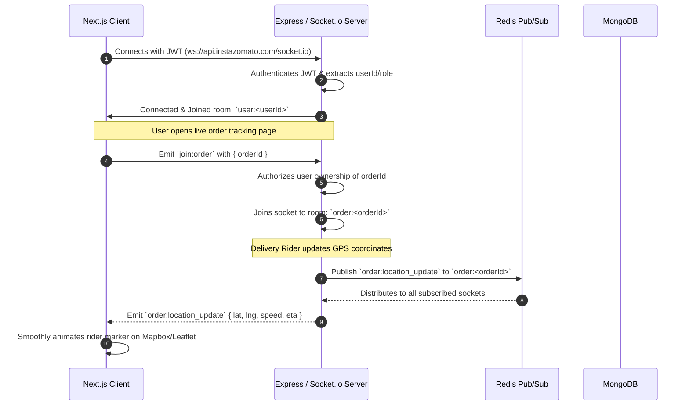
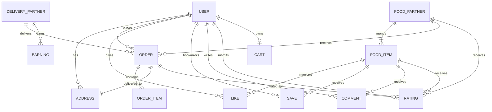

# 🏛️ System Architecture — Insta-Zomato

> **Document:** 02-ARCHITECTURE.md  
> **Target Audience:** Engineering Leads, Backend & Frontend Developers, DevOps  
> **System Classification:** Hybrid Visual Discovery (Video Streaming CDN) + Real-Time Food Delivery Engine  

---

## 1. High-Level System Topology

Insta-Zomato utilizes a **Modular Service-Oriented Architecture** designed for high video-throughput and real-time state synchronization.

```mermaid
graph TD
    subgraph Client Layer
        Web[Next.js 15 App Router - Web & PWA]
        PartnerApp[Restaurant Studio Dashboard]
        RiderApp[Delivery Partner Mobile PWA]
        AdminApp[Admin Management Portal]
    end

    subgraph Edge & Ingress Layer
        CDN[Cloudinary Video & Asset CDN]
        LB[Reverse Proxy / Nginx / Cloudflare]
    end

    subgraph Application Server
        API[Express.js v5 REST API Gateway]
        SocketServer[Socket.io Real-Time Event Hub]
        AuthService[Auth & RBAC Middleware]
        OrderEngine[Order FSM & State Machine]
        FeedEngine[Personalized Feed & Recommendation Service]
        DispatchEngine[Geospatial Rider Dispatcher]
    end

    subgraph In-Memory & Caching Layer
        RedisCache[(Redis Cache - Feeds, Sessions, Rate Limits)]
        RedisPubSub[(Redis Pub/Sub - Multi-instance Socket adapter)]
    end

    subgraph Data & Storage Persistence
        MongoDB[(MongoDB Primary Replica Set)]
        CloudinaryStore[(Cloudinary Media Storage)]
    end

    subgraph External 3rd-Party APIs
        Razorpay[Razorpay Payment Gateway]
        GoogleMaps[Google Maps / Distance Matrix API]
        Nodemailer[SMTP Email Dispatcher]
        SMS[Twilio / AWS SNS - OTP Dispatch]
    end

    Client Layer --> LB
    Client Layer --> CDN
    LB --> API
    LB --> SocketServer

    API --> AuthService
    AuthService --> FeedEngine
    AuthService --> OrderEngine
    AuthService --> DispatchEngine

    FeedEngine --> RedisCache
    FeedEngine --> MongoDB
    FeedEngine --> CloudinaryStore

    OrderEngine --> MongoDB
    OrderEngine --> Razorpay
    OrderEngine --> SocketServer

    DispatchEngine --> GoogleMaps
    DispatchEngine --> MongoDB
    DispatchEngine --> RedisCache

    SocketServer --> RedisPubSub
    OrderEngine --> Nodemailer
    DispatchEngine --> SMS
```

---

## 2. Core Subsystems & Component Breakdown

### 2.1 Video Ingestion & Streaming Pipeline
Short-form vertical video is the primary conversion driver. The media pipeline is engineered for zero-buffering and low Time-To-First-Frame (TTFF):

```mermaid
flowchart LR
    A[Partner Records Vertical Food Reel] --> B[Client Video Compression]
    B --> C[Multer Memory Storage Buffer]
    C --> D[Cloudinary Video Upload API]
    D --> E[Cloudinary AI Auto-Transcoding & Poster Extraction]
    E --> F[HLS Adaptive Bitrate Stream + WebP Poster URL]
    F --> G[Saved to MongoDB Food Collection]
    G --> H[Distributed via Global CDN Edge]
    H --> I[Next.js Swiper / IntersectionObserver Auto-Play]
```



1. **Client Upload:** Video validation ensures MP4/WebM format, $\le$ 60 seconds duration, and $\le$ 50MB file size.
2. **Cloudinary Pipeline:** The backend stream-pipes the buffer directly to Cloudinary. It applies transformations:
   - `quality: "auto"`
   - `fetch_format: "auto"` (delivers AV1/VP9 for modern browsers, H.264 fallback)
   - `poster: true` (extracts frame at 0.5s for instant thumbnail rendering).
3. **Frontend Playback Buffer:** Next.js video component utilizes `IntersectionObserver` to pre-load adjacent reels ($N-1$ and $N+1$) while playing video $N$ in a seamless loop.

---

### 2.2 Feed Generation & Recommendation Algorithm
The discovery feed combines geographic proximity with engagement ranking:

$$\text{Reel Score} = w_1 \cdot \text{Proximity} + w_2 \cdot \text{EngagementRate} + w_3 \cdot \text{Freshness} + w_4 \cdot \text{UserAffinity}$$

- **Proximity Score ($w_1 = 0.40$):** Decay function based on distance between user's current GPS and restaurant coordinates:
  $$\text{Proximity} = \max\left(0, 1 - \frac{\text{distance\_km}}{10}\right)$$
- **Engagement Rate ($w_2 = 0.30$):**
  $$\text{EngagementRate} = \frac{\text{Likes} \times 2 + \text{Saves} \times 3 + \text{OrdersFromReel} \times 5}{\text{Views} + 10}$$
- **Freshness ($w_3 = 0.15$):** Exponential decay with a 48-hour half-life.
- **User Affinity ($w_4 = 0.15$):** Cosine match between user dietary preferences (Veg, Spice level, Cuisine) and the dish tags.

---

### 2.3 Real-Time WebSocket Architecture (Socket.io)

To avoid polling, state updates are broadcast over authenticated WebSocket channels.



#### Socket Room Topology:
| Room Pattern | Participants | Purpose |
|---|---|---|
| `user:<userId>` | Specific Customer | Personal notifications, order confirmation, refund alerts |
| `partner:<partnerId>` | Restaurant Dashboard | Incoming order chimes, cancellation alerts, review alerts |
| `delivery:<deliveryId>` | Delivery Rider App | Dispatch order broadcasts, route assignment, payment credit |
| `order:<orderId>` | Customer + Partner + Rider | Live order status changes, driver GPS coordinates |

---

### 2.4 Geospatial Dispatching Engine

When an order is flagged `READY_FOR_PICKUP`:
1. **Find Eligible Riders:** Query MongoDB for online delivery partners within a 5 km radius using a 2dsphere index:
   ```javascript
   const nearbyRiders = await DeliveryPartner.find({
     isOnline: true,
     currentOrder: null,
     currentLocation: {
       $nearSphere: {
         $geometry: { type: "Point", coordinates: [restaurantLng, restaurantLat] },
         $maxDistance: 5000 // 5,000 meters
       }
     }
   }).limit(5);
   ```
2. **Dispatch Queue:** Send socket event `delivery:request` to the closest rider with a 30-second accept timer.
3. **Locking & Handshake:** If rider accepts, acquire a Redis distributed lock (`SET order:lock:<orderId> riderId NX EX 30`) to prevent race conditions, assign `deliveryPartner: riderId`, and set status to `PICKED_UP`.

---

## 3. Database Schema & Data Modeling (MongoDB)



### 3.1 Entity Specifications

#### User Schema (`users`)
```typescript
interface IUser {
  _id: ObjectId;
  fullName: string;
  email: string; // Unique, Indexed
  password?: string; // Hashed with bcrypt
  phone?: string;
  avatarUrl?: string;
  role: 'customer' | 'admin';
  preferences: {
    isVegOnly: boolean;
    spiceLevel: 'mild' | 'medium' | 'hot';
    favoriteCuisines: string[];
    allergies: string[];
  };
  refreshToken?: string; // Hashed
  isBanned: boolean;
  createdAt: Date;
  updatedAt: Date;
}
```

#### FoodPartner Schema (`foodpartners`)
```typescript
interface IFoodPartner {
  _id: ObjectId;
  name: string;
  email: string; // Unique
  password?: string;
  phone: string;
  restaurantName: string;
  description: string;
  logo: string;
  coverImage: string;
  fssaiLicenseNumber: string;
  cuisine: string[];
  location: {
    type: 'Point';
    coordinates: [number, number]; // [longitude, latitude] - 2dsphere indexed
    address: string;
    city: string;
    pincode: string;
  };
  openingHours: {
    openTime: string; // e.g. "10:00"
    closeTime: string; // e.g. "23:00"
    daysOpen: string[];
  };
  isOpen: boolean;
  isApproved: boolean; // Approved by admin
  avgRating: number;
  totalRatings: number;
  createdAt: Date;
}
```

#### FoodItem Schema (`foods`)
```typescript
interface IFoodItem {
  _id: ObjectId;
  foodPartner: ObjectId; // Ref -> FoodPartner, Indexed
  name: string;
  description: string;
  price: number;
  discountedPrice?: number;
  category: ObjectId; // Ref -> Category
  tags: string[]; // ['spicy', 'bestseller', 'paneer']
  videoUrl: string; // Cloudinary HLS/MP4 URL
  thumbnailUrl: string; // Cloudinary WebP Poster
  cloudinaryPublicId: string;
  isVeg: boolean;
  spiceLevel: 'mild' | 'medium' | 'hot';
  preparationTimeMinutes: number;
  isAvailable: boolean;
  likeCount: number;
  saveCount: number;
  commentCount: number;
  orderCount: number;
  ratings: {
    average: number;
    count: number;
  };
  createdAt: Date;
}
```

#### Order Schema (`orders`)
```typescript
interface IOrder {
  _id: ObjectId;
  orderNumber: string; // e.g. "IZ-2026-89412"
  user: ObjectId; // Ref -> User
  partner: ObjectId; // Ref -> FoodPartner
  deliveryPartner?: ObjectId; // Ref -> DeliveryPartner
  items: Array<{
    food: ObjectId;
    name: string;
    price: number;
    quantity: number;
    thumbnailUrl: string;
  }>;
  deliveryAddress: {
    label: string;
    street: string;
    landmark?: string;
    city: string;
    pincode: string;
    coordinates: [number, number];
  };
  pricing: {
    subtotal: number;
    deliveryFee: number;
    taxes: number;
    platformFee: number;
    discountAmount: number;
    total: number;
  };
  status: 'PENDING' | 'CONFIRMED' | 'PREPARING' | 'READY_FOR_PICKUP' | 'PICKED_UP' | 'OUT_FOR_DELIVERY' | 'DELIVERED' | 'CANCELLED';
  paymentStatus: 'PENDING' | 'PAID' | 'FAILED' | 'REFUNDED';
  paymentMethod: 'RAZORPAY' | 'WALLET' | 'COD';
  razorpayOrderId?: string;
  razorpayPaymentId?: string;
  deliveryOtp: string; // Hashed 4-digit OTP
  timeline: Array<{
    status: string;
    timestamp: Date;
    note?: string;
  }>;
  cancellationReason?: string;
  createdAt: Date;
}
```

---

## 4. Caching & Performance Architecture (Redis)

| Cache Key Pattern | Data Structure | TTL | Invalidation Trigger |
|---|---|---|---|
| `feed:trending:<city>` | Sorted Set / JSON List | 15 minutes | Cron update / Popularity threshold |
| `food:detail:<foodId>` | String (JSON) | 1 hour | Food partner edits item / availability |
| `partner:menu:<partnerId>` | String (JSON) | 30 minutes | Partner adds/updates dish |
| `categories:all` | String (JSON) | 24 hours | Admin adds/edits category |
| `user:cart:<userId>` | Hash / JSON | 7 days | Add/Remove item, checkout complete |
| `geo:rider:locations` | GeoSet (`GEOADD`) | 10 seconds | Rider updates GPS ping |

---

## 5. Security & Protection Matrix

1. **Zero Trust Auth:**
   - Access tokens (15-min life) verified statelessly in memory.
   - Refresh tokens stored in HTTP-only, `SameSite=Strict`, `Secure` cookies, backed by hashed DB records with revocation capability.
2. **Layered Rate Limiting:**
   - Global Gateway: 100 requests / 15 mins per IP.
   - Auth Routes: 10 requests / 15 mins per IP (Brute-force protection).
   - Video Upload: 10 requests / hour per Food Partner.
   - Order Creation: 10 requests / minute per User.
3. **Data Sanitization:**
   - `express-mongo-sanitize` strips `$` and `.` to eliminate NoSQL injection risks.
   - `xss-clean` strips dangerous script tags and escaped HTML.
   - `helmet` configures CSP, HSTS, and X-Content-Type-Options.
