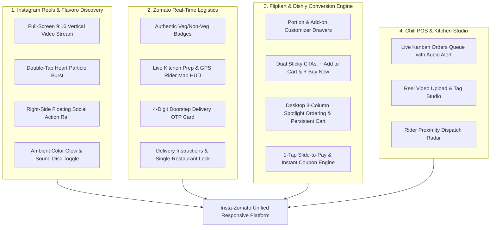

# 🎨 UI/UX & Design System — Insta-Zomato

> **Document:** 03-DESIGN.md  
> **Status:** Approved / Master Reference  
> **Version:** 2.0.0  
> **Design Archetype:** Tri-Hybrid Visual E-Commerce (**Zomato** Food Logistics + **Instagram** Reels Immersion + **Flipkart** High-Conversion E-Commerce)  
> **Inspiration Influences:** **Flavoro** (Gourmet Luxury & Micro-interactions), **Dishly** (Widescreen PC Ordering), **Chili POS** (Kitchen & Partner Studio), **Shohidul UIX** (Mobile Delivery Cards & Fluid Navigation)  
> **Component Stack:** **shadcn/ui** (Radix UI Primitives) + **Tailwind CSS v4** + **Lucide Icons** + **Framer Motion** + **Vaul Drawers**  
> **Frontend Framework:** Next.js 16 (App Router / TypeScript)  

---

## 1. Design DNA: The Tri-Hybrid Visual Commerce Engine

Insta-Zomato merges short-form video discovery with real-time food delivery and high-converting e-commerce flows across **Mobile (375px–430px)** and **PC / Desktop (1280px–1920px+)**:



---

## 2. Design System Tokens & Color Palette

Insta-Zomato features a **Dual-Theme Color Engine** with an interactive top-bar Theme Toggle:
- **☀️ Light Mode (Dishly Crisp Professional):** *Floating pure white cards, crisp zinc typography, and scarlet highlights* — inspired by the Dishly desktop ordering UI.
- **🌑 Dark Mode (Obsidian Dark Gourmet):** *Obsidian Navy Glass, high-contrast food video playback, and glowing ambient halos*.

#### ☀️ Dishly Crisp Professional Light Theme
- **Canvas / App Background:** `#F4F5F8` (Crisp Soft Gray)
- **Floating Card Surface:** `#FFFFFF` (Pure Crisp White)
- **Elevated / Secondary Card:** `#F9FAFB`
- **Card Border:** `#E4E4E7` / `#E2E8F0` (Fine Crisp Stroke)
- **Primary Vibrant Accent:** `#DC2626` / `#E11D48` (Dishly Scarlet Red)
- **Primary Pill Background:** `#FEF2F2` (Soft Blush)
- **Black Accent (Active Filter Pills & CTA Buttons):** `#18181B` (Zinc 900)
- **Text Headings:** `#18181B` (High Contrast Black)
- **Text Body / Muted:** `#71717A` (Muted Slate)
- **Elevation Shadows:** `0 10px 30px -5px rgba(0, 0, 0, 0.05)`

#### 🌑 Obsidian Dark Gourmet Theme
- **Background Canvas:** `#080A0F` (Pitch Dark Charcoal)
- **Card Surface:** `#12141D` (Obsidian Navy Glass)
- **Card Elevated:** `#1C1F2C` (Floating Glass Shelf)
- **Border / Divider:** `rgba(255, 255, 255, 0.08)`
- **Primary Brand Coral:** `#FF385C` (Zomato Vibrant Coral)
- **Secondary Sizzle Orange:** `#FF6433` (Warm Sizzle Glow)
- **Pure Veg Indicator:** `#10B981` (Emerald Green)
- **Non-Veg Indicator:** `#EF4444` (Ruby Red)
- **Text Primary:** `#FFFFFF`
- **Text Muted:** `#94A3B8` (Slate Muted)

### 2.1 CSS Variables & Design Tokens

```css
@layer base {
  /* ── Obsidian Dark Gourmet Theme (Default) ── */
  :root,
  .dark {
    --background: 224 28% 5%;          /* Deep Obsidian #080A0F */
    --foreground: 0 0% 98%;            /* Crystal White #FAFAFA */
    
    --card: 224 20% 9%;                /* Charcoal Glass #12141D */
    --card-foreground: 0 0% 98%;
    --card-elevated: 224 18% 14%;       /* Hover / Active Surface #1C1F2C */
    
    --popover: 224 20% 9%;
    --popover-foreground: 0 0% 98%;

    /* ── Brand Primary & Accents ── */
    --primary: 348 100% 61%;           /* Sizzling Coral #FF385C */
    --primary-foreground: 0 0% 100%;
    --primary-hover: 348 100% 54%;
    
    --secondary: 16 100% 60%;          /* Ember Flame / Orange #FF6433 */
    --secondary-foreground: 0 0% 100%;
    
    --accent-gold: 38 100% 54%;        /* Amber Honey / Gold #FFA116 */
    --accent-gold-foreground: 224 28% 5%;

    /* ── Dietary Badges (Standardized) ── */
    --veg: 142 76% 45%;                /* Emerald Pure-Veg #10B981 */
    --veg-bg: 142 76% 45% / 0.12;
    --nonveg: 0 84% 60%;               /* Crimson Non-Veg #EF4444 */
    --nonveg-bg: 0 84% 60% / 0.12;
    --egg: 45 93% 47%;                 /* Egg Yellow #EAB308 */

    /* ── Glassmorphism & Borders ── */
    --glass-bg: rgba(18, 20, 29, 0.72);
    --glass-border: rgba(255, 255, 255, 0.09);
    --glass-highlight: rgba(255, 255, 255, 0.04);
    --glass-blur: blur(16px);
    
    /* ── Shadows & Ambient Glow ── */
    --shadow-reel: 0 24px 60px -12px rgba(0, 0, 0, 0.85);
    --shadow-glow-coral: 0 0 35px rgba(255, 56, 92, 0.35);
    --shadow-glow-amber: 0 0 30px rgba(255, 161, 22, 0.28);
    
    /* ── Geometry ── */
    --radius-sm: 0.5rem;   /* 8px */
    --radius-md: 0.875rem; /* 14px */
    --radius-lg: 1.25rem;  /* 20px */
    --radius-full: 9999px; /* Pill */
  }

  /* ── Warm Organic Flavoro Light Theme ── */
  .light {
    --background: 40 33% 98%;          /* Warm Vanilla Cream #FAF8F5 */
    --foreground: 120 10% 12%;         /* Deep Forest Slate #1C211C */
    
    --card: 0 0% 100%;                 /* Pure White #FFFFFF */
    --card-foreground: 120 10% 12%;
    --card-elevated: 40 25% 94%;       /* Warm Oat #F2ECE4 */
    
    --popover: 0 0% 100%;
    --popover-foreground: 120 10% 12%;

    /* ── Brand Accents (Flavoro Gourmet) ── */
    --primary: 94 35% 26%;             /* Artisan Olive #3D5A2B */
    --primary-foreground: 0 0% 100%;
    --primary-hover: 94 35% 20%;
    
    --secondary: 38 60% 48%;           /* Saffron Gold #C5A869 */
    --secondary-foreground: 0 0% 100%;
    
    --accent-gold: 38 90% 50%;
    --accent-gold-foreground: 0 0% 100%;

    --veg: 142 70% 36%;
    --veg-bg: 142 70% 36% / 0.10;
    --nonveg: 0 78% 54%;
    --nonveg-bg: 0 78% 54% / 0.10;

    --glass-bg: rgba(255, 255, 255, 0.85);
    --glass-border: rgba(0, 0, 0, 0.08);
    --glass-highlight: rgba(0, 0, 0, 0.02);
    --glass-blur: blur(12px);

    --shadow-reel: 0 20px 40px -10px rgba(61, 90, 43, 0.12);
    --shadow-glow-coral: 0 8px 24px rgba(61, 90, 43, 0.15);
  }
}
```

---

## 3. Typography & Hierarchy

- **Display Headline Font:** `Outfit`, sans-serif (Bold, energetic, appetite-inducing for titles, prices, and banners).
- **Luxury Editorial Font:** `Playfair Display`, serif (Optional elegant display for gourmet collections & restaurant branding).
- **Body & UI Font:** `Plus Jakarta Sans`, `Inter`, sans-serif (Crisp legibility across 4K displays and compact mobile screens).

### Typography Scale Matrix

| Element | Size | Weight | Line Height | Tracking | Usage |
|---|---|---|---|---|---|
| **Display 1** | 36px / 2.25rem | 800 (ExtraBold) | 1.15 | -0.03em | Splash Headlines, Hero Banners |
| **Headline 2** | 24px / 1.5rem | 700 (Bold) | 1.25 | -0.02em | Dish Titles, Section Headers |
| **Headline 3** | 18px / 1.125rem | 600 (SemiBold) | 1.35 | -0.01em | Modal Headers, Restaurant Names |
| **Body Large** | 15px / 0.9375rem | 500 (Medium) | 1.5 | 0 | Descriptions, Customizer Options |
| **Body Regular**| 13px / 0.8125rem | 400 (Regular) | 1.45 | 0 | Subtitles, Add-on Descriptions |
| **Caption / Pill** | 11px / 0.6875rem| 700 (Bold) | 1.2 | +0.02em | Badges, ETA Pills, Veg/Non-Veg |

---

## 4. Responsive Viewport Grid Architecture

### 4.1 Responsive Breakpoints

| Viewport Category | Screen Width | Primary Layout Structure |
|---|---|---|
| **Mobile Portrait** | `375px – 430px` | 100dvh Full-screen Reels + Floating Action Rail + Bottom Drawers + 5-Tab Bottom Nav |
| **Tablet / Foldable** | `768px – 1024px` | 2-Column Split: 9:16 Video Player on Left + Live Modifier / Cart on Right |
| **Desktop / Laptop** | `1280px – 1536px` | 3-Column Dishly Layout: Left Nav (240px) + Center Video Stage (Flex 1) + Right Cart (380px) |
| **Ultra-Wide Widescreen** | `1920px+` | Max-width `1600px` container with ambient backlight halo projection |

```
┌───────────────────────────────────────────────────────────────────────────────────────────┐
│                                 DESKTOP 3-COLUMN GRID MATRIX                              │
├────────────────────────────┬───────────────────────────────┬──────────────────────────────┤
│  COLUMN 1: NAVIGATION      │  COLUMN 2: VIDEO STAGE        │  COLUMN 3: E-COMMERCE PANEL  │
│  Width: 240px - 280px      │  Width: Flex 1 (Centered 9:16)│  Width: 360px - 420px        │
│                            │                               │                              │
│  • Brand Logo & Role Pill  │  • Top Location & Search Bar  │  • Dish Spotlight / Video Meta│
│  • Primary Nav (Feed,      │  • 9:16 Phone-Aspect Frame    │  • Portion Size (RadioGroup) │
│    Explore, Orders, Saved) │    (Max 440px × 760px)        │  • Spice Level & Add-ons     │
│  • Category Tree with      │  • Dynamic Ambient Backlight  │  • Quantity Stepper (- 1 +)  │
│    item count badges       │  • Keyboard shortcuts (↑/↓,M) │  • ⚡ Buy Now & Add to Cart │
│  • User Profile & Balance  │  • Double-tap heart burst     │  • Sticky Cart & Bill Accord.│
└────────────────────────────┴───────────────────────────────┴──────────────────────────────┘
```

---

## 5. Master Component Library Mapping (shadcn/ui + Custom Primitives)

Every component is built on accessible **Radix UI** primitives styled with **Tailwind CSS**:

```mermaid
graph LR
    subgraph Primitives [Radix Primitives & shadcn/ui]
        R1[Dialog / Sheet / Drawer]
        R2[RadioGroup / Checkbox / Switch]
        R3[Progress / Slider / Tabs]
        R4[Command / Popover / Tooltip]
    end

    subgraph CustomComponents [Insta-Zomato Custom Molecules]
        C1[ReelVideoPlayer with HLS Streaming]
        C2[SocialActionRail with Spring Heart]
        C3[DishModifierDrawer with Price Recalc]
        C4[SingleRestaurantCartLock Dialog]
        C5[LiveOrderTrackingMap HUD]
        C6[PartnerIncomingOrders Kanban]
    end

    Primitives --> CustomComponents
```



| Component Name | Source Primitive | Features & Interaction Behavior |
|---|---|---|
| **`<ReelPlayer />`** | Native `<video>` + Framer Motion | Snap-scrolling, pre-buffering next 2 videos, intersection observer autoplay/pause, ambient glow canvas. |
| **`<ActionRail />`** | `Button` + `Tooltip` | Optimistic like with particle explosion, comment count trigger, save bookmark, audio vinyl rotating animation. |
| **`<DietaryBadge />`** | Custom SVG + `Badge` | Standard green square with green dot for Pure Veg; red square with red triangle for Non-Veg. |
| **`<ModifierDrawer />`** | `vaul` (`Drawer`) on Mobile / `Card` on PC | Portion selector, spice pill group, extra add-ons checkboxes, live price calculation badge. |
| **`<CartConflictDialog />`** | `AlertDialog` | Single-restaurant lock trigger: *"Replace cart items with [Restaurant B]?"* with Cancel or Force Replace. |
| **`<SlideToPay />`** | Framer Motion `motion.div` | Swipe-to-confirm checkout slider with haptic feedback, triggers Razorpay modal on completion. |
| **`<LiveOrderMapHUD />`** | Leaflet / Mapbox GL + `Progress` | Dark vector tiles, pulsing restaurant marker, real-time rider scooter marker glide, 4-stage order stepper. |
| **`<DeliveryOTPCard />`** | `Card` + Glowing border | 4-digit high-visibility security PIN (`OTP: 8392`) with copy button. |
| **`<PartnerPOSKanban />`** | `Tabs` + `Card` + `Audio` | Incoming orders queue (`New` $\to$ `Preparing` $\to$ `Ready`), countdown timers, instant sound chime on socket event. |

---

## 6. Micro-Interactions & Animation Specs

1. **Double-Tap Like Explosion:**
   - Double tapping anywhere on video spawns an animated heart at `(clientX, clientY)`.
   - Framer Motion animation: `scale: [0, 1.4, 1]`, `opacity: [0, 1, 0]`, duration `0.85s`, ease `easeInOut`.
2. **Fly-to-Cart Animation:**
   - When tapping `+ Add to Cart`, a 40px circular food thumbnail follows a quadratic Bézier curve to the top/bottom Cart Icon.
3. **Ambient Color Backlight Halo (Desktop Web):**
   - Video frames are sampled via an off-screen `<canvas>` to generate a 3-stop dynamic radial gradient:
   - `background: radial-gradient(circle at center, rgba(dominantColor, 0.45) 0%, transparent 70%)`.
4. **Keyboard Navigation Matrix (PC):**
   - `ArrowDown` / `J`: Next Food Reel
   - `ArrowUp` / `K`: Previous Food Reel
   - `Space`: Play / Pause Toggle
   - `M`: Audio Mute / Unmute
   - `L`: Like Reel
   - `C`: Open Comments Sheet
   - `A`: Add to Cart
   - `B`: Buy Now (Open Checkout)
