# 🎨 UI/UX & Design System — Insta-Zomato

> **Document:** 03-DESIGN.md  
> **Design Philosophy:** Tri-Hybrid Visual E-Commerce (**Zomato** Food Delivery + **Instagram** Reels Immersion + **Flipkart** High-Conversion E-Commerce)  
> **Component Library:** **shadcn/ui** (Radix UI Primitives + Tailwind CSS + Lucide Icons + Framer Motion)  
> **Frontend Framework:** Next.js 15 (App Router / TypeScript / Tailwind CSS)  

---

## 1. Design DNA: The Tri-Hybrid Experience

Insta-Zomato converges the 3 most successful consumer app interfaces in modern commerce:

```mermaid
graph TD
    subgraph Instagram Reels
        A[Full-Screen 9:16 Vertical Video]
        B[Double-Tap Heart Particle Animation]
        C[Right-Side Floating Social Action Rail]
        D[Interactive Comments & Share Drawer]
    end

    subgraph Zomato Food Delivery
        E[Authentic Veg/Non-Veg Badges]
        F[Live Kitchen Prep & GPS Rider Map HUD]
        G[Restaurant Profile, Cuisine & Rating Badges]
        H[Delivery Instructions - Leave at door]
    end

    subgraph Flipkart High-Conversion E-Commerce
        I[Portion & Add-on Customization Sheets]
        J[Lightning Deals, Countdown & % OFF Badges]
        K[Sticky Dual Bottom Bar: Quick Add & Buy Now]
        L[Trust Badges & SuperCoins / Loyalty Rewards]
    end

    A & E & I --> HUD[Insta-Zomato Unified Experience]
    B & F & J --> HUD
    C & G & K --> HUD
    D & H & L --> HUD
```



1. **Instagram Video Dominance:** 100% immersive vertical video player with touch-swipe gestures, sound disc toggle, and ambient edge glow.
2. **Zomato Culinary Trust & Delivery Mastery:** Clear dietary indicators (Veg/Non-Veg icons), restaurant distance badges (`2.1 km • 25 mins`), live tracking map with animated delivery motorbike icon, and delivery instruction pills.
3. **Flipkart E-Commerce Conversion Engine:** Sticky bottom dual-action bar (`+ Add to Cart` / `⚡ Buy Now`), bottom-sheet modifier customizers (Size, Extra Cheese, Spice Level), flash deal banners (`🔥 40% OFF`), and clear price breakdown accordions.
4. **shadcn/ui Modern Component Architecture:** Built on accessible Radix primitives, styled with Tailwind utility classes, enhanced with Vaul drawers, Sonner toasts, and Lucide icons.

---

## 2. Color Palette & Design Tokens

### 2.1 Theme Palette (Dark Mode First + Light Theme Support)

```css
@layer base {
  :root {
    /* ── Surface Tokens ── */
    --background: 220 20% 6%;         /* Deep Obsidian #0D0F12 */
    --foreground: 0 0% 98%;           /* Pure White #FAFAFA */
    --card: 220 18% 10%;              /* Surface Card #14171E */
    --card-foreground: 0 0% 98%;
    --popover: 220 18% 10%;
    --popover-foreground: 0 0% 98%;

    /* ── Brand & Action Accents ── */
    --primary: 348 100% 61%;          /* Zomato/Insta Crimson Coral #FF385C */
    --primary-foreground: 0 0% 100%;
    --secondary: 36 100% 55%;         /* Saffron / Flipkart Gold #FFA41B */
    --secondary-foreground: 220 20% 6%;
    --accent: 217 91% 60%;            /* Flipkart Royal Blue #2874F0 */
    --accent-foreground: 0 0% 100%;

    /* ── Dietary & Status Hues ── */
    --veg: 142 76% 45%;               /* Pure Veg Emerald #10B981 */
    --nonveg: 0 84% 60%;              /* Non-Veg Crimson #EF4444 */
    --egg: 45 93% 47%;                /* Contains Egg #EAB308 */
    --bestseller: 270 75% 60%;        /* Bestseller Purple #8B5CF6 */

    /* ── Glassmorphism & UI Accents ── */
    --glass-bg: rgba(20, 23, 30, 0.75);
    --glass-border: rgba(255, 255, 255, 0.12);
    --glass-highlight: rgba(255, 255, 255, 0.05);
    --shadow-reel: 0 20px 50px rgba(0, 0, 0, 0.7);
    --shadow-glow: 0 0 25px rgba(255, 56, 92, 0.35);

    /* ── UI Radius ── */
    --radius: 1rem;
  }
}
```

---

## 3. shadcn/ui Component Mapping

Every interactive screen in Insta-Zomato is composed using **shadcn/ui** components for maximum polish, accessibility, and consistency:

| UI Feature Area | shadcn/ui Component | Purpose & Customization |
|---|---|---|
| **Video Overlay Actions** | `Button`, `Badge`, `Avatar`, `Tooltip` | Action rail (Like, Save, Share, Sound), Veg/Non-veg emblem, Restaurant badge. |
| **Comments Drawer** | `Sheet` / `Drawer` (Vaul) | Swipeable bottom sheet displaying 2-level comment threads with avatar pills. |
| **Customization & Add-ons** | `Dialog`, `RadioGroup`, `Checkbox` | Flipkart-style portion sizing (Regular/Large), extra toppings, spice level selector. |
| **Quick-Cart & Checkout** | `Sheet`, `Separator`, `ScrollArea` | Slide-out cart with item steppers, delivery instructions, and coupon input. |
| **Food Category Filter** | `Carousel` (Embla), `Tabs` | Horizontal swipeable story circles & category pills (Pizza, Biryani, Burgers). |
| **Live Order Tracking** | `Progress`, `Card`, `Badge` | Step-by-step cooking & delivery status bar, OTP code display card. |
| **Search & Discovery** | `Command`, `Popover` | Instant food & restaurant auto-complete search box with recent history. |
| **Interactive Map HUD** | `HoverCard`, `Badge` | Delivery partner marker card with live ETA, vehicle number, and call button. |
| **Notifications & Toasts** | `Sonner` | High-polish animated toast alerts (`Item added to cart`, `Coupon CRAVE50 applied`). |
| **Price & Bill Accordion** | `Accordion` | Expandable itemized bill (Subtotal, GST, Delivery Partner Tip, Platform Fee). |
| **Loading Skeletons** | `Skeleton` | Shimmer placeholders for video reels, dish cards, and order histories. |

---

## 4. Screen Wireframe Specifications

### 4.1 Immersive Reels Viewport (Instagram + Zomato + Flipkart HUD)

```
┌────────────────────────────────────────────────────────────────────────┐
│ [📍 Indiranagar, Bangalore ▾]   [⚡ Flash Deal 30m left]   [🛒 (2) ₹448] │ <- Top Navigation
├────────────────────────────────────────────────────────────────────────┤
│                                                                        │
│                                                     [ ❤️ 14.8k ]        │
│                                                     [ 💬 421   ]        │ <- Instagram-Style
│                   FULL-SCREEN                       [ 🔖 Save  ]        │    Right Action Rail
│                 VERTICAL (9:16)                     [ ↗️ Share ]        │
│                 FOOD VIDEO REEL                     [ 🔊 Sound ]        │
│                                                     [ 💿 Kitchen Mix ]  │
│                                                                        │
│ ┌────────────────────────────────────────────────────────────────────┐ │
│ │ [🟢 PURE VEG]  [⭐ 4.9 (1.2k)]  [🔥 Bestseller - 15% OFF]          │ │ <- Zomato + Flipkart
│ │ Truffle Butter Paneer Tikka (6 Pcs)                                │ │    Dish Info Glass Box
│ │ ₹320  ̶₹̶3̶8̶0̶  • ⏱️ 20 mins prep • 📍 Spice Villa (1.8 km away)       │ │
│ │ "Marinated in clay oven with fresh malai & black truffle oil"      │ │
│ └────────────────────────────────────────────────────────────────────┘ │
│                                                                        │
│ ┌──────────────────────────────────┐  ┌──────────────────────────────┐ │
│ │  🛒 + Add to Cart (₹320)         │  │  ⚡ Buy Now (1-Tap Checkout)  │ │ <- Flipkart Sticky Bar
│ └──────────────────────────────────┘  └──────────────────────────────┘ │
├────────────────────────────────────────────────────────────────────────┤
│   [🏠 Reels]     [🔍 Explore]     [🏷️ Offers]     [📦 Orders]     [👤 Me]  │ <- Bottom Navigation
└────────────────────────────────────────────────────────────────────────┘
```

#### Detailed Element Specifications:
1. **Top Glass Header (`shadcn/ui NavigationMenu + Badge`):**
   - Location Selector dropdown: Displays current delivery address with micro-distance radius.
   - Flash Deal Countdown Pill: Animated badge showing live countdown timer for flash discounts.
   - Quick Cart Button: Displays real-time item count badge and subtotal pill.
2. **Right Action Rail (`shadcn/ui Button + Tooltip`):**
   - **Like Button:** Animated heart with double-tap burst effect and formatted count (`14.8k`).
   - **Comment Button:** Opens the `shadcn/ui Sheet` comment drawer.
   - **Save / Bookmark:** Saves reel to user's "Food Wishlist".
   - **Share Button:** Native Web Share API trigger with link copy.
   - **Sound Toggle & Music Disc:** Rotating disc animation reflecting restaurant audio.
3. **Bottom Dish Capsule (`shadcn/ui Card + Badge`):**
   - Dietary Badge: Zomato-standard Veg green dot in square or Non-Veg red triangle in square.
   - Price Display: Golden saffron price with strikethrough MRP and savings badge (`Save ₹60`).
   - Restaurant Info: Clickable handle (`@SpiceVilla`) opening the restaurant menu profile.
4. **Dual Conversion CTAs (`shadcn/ui Button`):**
   - **`+ Add to Cart` (Left 50%):** Adds item to cart and slides in a quick modifier drawer if the dish has portions/add-ons.
   - **`⚡ Buy Now` (Right 50%):** Skips to the 1-Tap Slide-to-Pay checkout sheet.

---

### 4.2 Flipkart-Style Dish Customization Drawer (`shadcn/ui Drawer + RadioGroup + Checkbox`)

When a user taps `+ Add to Cart` on a customizable dish (e.g., Pizza, Biryani, Burgers):

```
┌────────────────────────────────────────────────────────────────────────┐
│ ──── [Drag Handle] ─────────────────────────────────────────────────── │
│ Truffle Butter Paneer Tikka — Customise Your Order                     │
│ ────────────────────────────────────────────────────────────────────── │
│                                                                        │
│ 1. SELECT PORTION SIZE (Choose 1) *Required                            │
│    (o) Half (4 Pcs)                                         ₹220.00    │
│    ( ) Full (8 Pcs) - Most Popular                          ₹380.00    │
│                                                                        │
│ 2. CHOOSE SPICE LEVEL (Choose 1)                                       │
│    ( ) Mild Butter    (o) Delhi Masala 🔥    ( ) Fire Chili 🌶️🌶️      │
│                                                                        │
│ 3. EXTRA ADD-ONS (Optional)                                            │
│    [x] Extra Mint Chutney & Pickled Onions                  +₹ 20.00   │
│    [ ] Garlic Butter Naan (1 pc)                            +₹ 45.00   │
│    [ ] Extra Melted Amul Cheese Dip                         +₹ 50.00   │
│                                                                        │
│ ────────────────────────────────────────────────────────────────────── │
│ Total: ₹400.00                         [  🛒 Add Item to Cart  ]       │
└────────────────────────────────────────────────────────────────────────┘
```

---

### 4.3 Zomato-Style Quick Cart & Slide-to-Pay Drawer (`shadcn/ui Sheet + Accordion`)

```
┌────────────────────────────────────────────────────────────────────────┐
│ ──── [Drag Handle] ─────────────────────────────────────────────────── │
│ 🛒 Your Cravings from "Spice Villa Restaurant" (1.8 km)                │
│ ────────────────────────────────────────────────────────────────────── │
│ 1x Truffle Butter Paneer Tikka (Full)                         ₹380.00  │
│    • Delhi Masala • Extra Mint Chutney                                 │
│    [ - ]  1  [ + ]                                                     │
│ 1x Garlic Butter Naan                                         ₹ 45.00  │
│    [ - ]  2  [ + ]                                                     │
│                                                                        │
│ 🎟️ [ CRAVE50 - ₹50 OFF Applied! ]                    [Remove]          │
│                                                                        │
│ 🛵 Delivery Instructions:                                              │
│ [ 🚪 Leave at door ]   [ 🔕 Don't ring bell ]   [ 📞 Call upon arrival ]│
│                                                                        │
│ 📍 Delivery Address: Flat 402, Sunshine Heights (Home)      [Change]   │
│                                                                        │
│ ▾ Detailed Bill Breakdown (Click to expand)                            │
│   • Item Total: ₹470.00                                                │
│   • Delivery Partner Fee: ₹30.00                                       │
│   • Platform Fee: ₹5.00                                                │
│   • Taxes & GST (5%): ₹23.50                                           │
│   • Coupon Discount: -₹50.00                                           │
│   • Grand Total: ₹478.50                                               │
│                                                                        │
│ [  💳 Slide to Pay ₹478.50 via UPI / Razorpay  ==================>  ]  │
└────────────────────────────────────────────────────────────────────────┘
```

---

### 4.4 Live Order Tracking & Driver HUD (Zomato Map + Flipkart Milestones)

```
┌────────────────────────────────────────────────────────────────────────┐
│ [← Back to Reels]         Order #IZ-90214           [🎧 Support]       │
├────────────────────────────────────────────────────────────────────────┤
│                                                                        │
│                   INTERACTIVE LIVE LEAFLET/MAPBOX MAP                  │
│                     (Smooth Dark Map Tile Layer)                       │
│                                                                        │
│              [ 🏠 Your Home ]                                          │
│                     ▲                                                  │
│                     │ (Pulsing Animated Route)                         │
│              [ 🛵 Vikram (Rider) ] -> Moving live                      │
│                     ▲                                                  │
│                     │                                                  │
│              [ 🍳 Spice Villa Kitchen ]                                │
│                                                                        │
├────────────────────────────────────────────────────────────────────────┤
│ 🟢 ON THE WAY  •  Arriving in 12 mins (ETA: 02:15 PM)                  │
│ [████████████████████████░░░░░░] 75% Completed                         │
│                                                                        │
│ 🔑 Share this OTP with Rider upon delivery:   [  8  3  2  1  ]          │
│                                                                        │
│ 🛵 Delivery Partner: Vikram Singh (⭐ 4.9 • 1,420 deliveries)          │
│    [ 📞 Call Vikram ]        [ 💬 Message ]       [ 💵 Tip ₹30 ]       │
└────────────────────────────────────────────────────────────────────────┘
```

---

## 5. Micro-Interactions & Motion Choreography

All animations are implemented using **Framer Motion** and **Tailwind Animate**:

```mermaid
graph LR
    A[Double Tap Video] -->|Framer Motion Scale & Particle Spring| B[Bursting Glowing Heart]
    C[Click Quick Add] -->|Bézier Curve Flight| D[Food Thumbnail Flies into Top Cart Pill]
    E[Slide to Pay Gesture] -->|Drag X constraint with Haptic Feedback| F[Launch Razorpay Modal]
    G[Rider GPS Ping] -->|Leaflet Marker Tweening (3000ms)| H[Smooth Motorbike Glide]
    I[Coupon Apply] -->|Confetti Canvas Explosion| J[Green Savings Pill Glow]
```

### Motion Presets:
1. **Drawer Spring:** `{ type: "spring", damping: 28, stiffness: 320 }`
2. **Heart Pulse Burst:** `{ scale: [0, 1.4, 1], opacity: [0, 1, 0], transition: { duration: 0.8 } }`
3. **Cart Bounce:** `{ scale: [1, 1.25, 1], transition: { duration: 0.3 } }`
4. **Shimmer Card Loading:** CSS continuous linear gradient sweep across skeleton frames.
