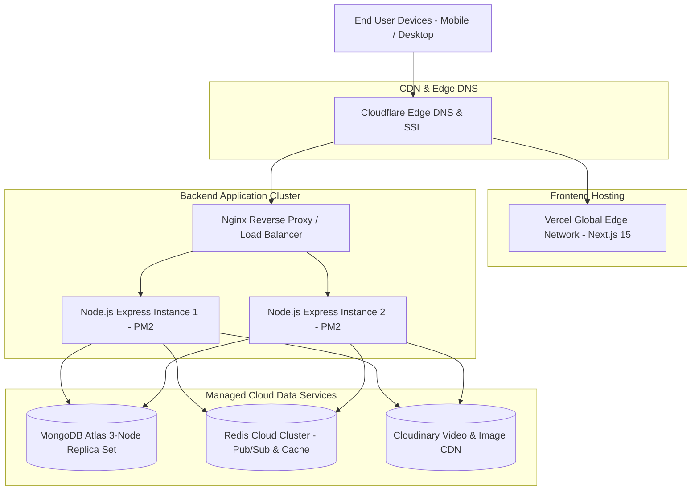

# 🚀 Production Deployment & DevOps Guide — Insta-Zomato

> **Document:** 08-DEPLOYMENT.md  
> **Target Environment:** Multi-Cloud Production (Vercel + Render / AWS EC2 + MongoDB Atlas + Redis Cloud + Cloudinary)  
> **Containerization:** Docker & Docker Compose  

---

## 1. Production Topology & Cloud Infrastructure



---

## 2. Docker Containerization

### 2.1 Backend Production Dockerfile (`backend/Dockerfile`)

```dockerfile
# Multi-stage production build for Node.js Express Backend
FROM node:22-alpine AS builder

WORKDIR /app

# Copy dependency manifests
COPY package*.json ./

# Install production dependencies only
RUN npm ci --only=production

# Copy source code
COPY . .

# Final lean runtime image
FROM node:22-alpine AS runner

WORKDIR /app

ENV NODE_ENV=production
ENV PORT=3000

# Create non-root system user for security
RUN addgroup -g 1001 -S nodejs && \
    adduser -S nodejs -u 1001 -G nodejs

# Copy installed artifacts from builder
COPY --from=builder --chown=nodejs:nodejs /app /app

# Switch to non-root user
USER nodejs

EXPOSE 3000

# Start server with graceful shutdown handling
CMD ["node", "server.js"]
```

---

### 2.2 Local Full-Stack `docker-compose.yml`

```yaml
version: '3.8'

services:
  # ── Express API Server ──────────────────────────────────────────────────────
  backend:
    build:
      context: ./backend
      dockerfile: Dockerfile
    container_name: insta_zomato_backend
    restart: always
    ports:
      - "3000:3000"
    environment:
      - NODE_ENV=development
      - PORT=3000
      - MONGO_URI=mongodb://mongo:27017/insta-zomato
      - REDIS_URL=redis://redis:6379
      - JWT_SECRET=super_secret_jwt_key_at_least_32_chars_long!
      - CLOUDINARY_CLOUD_NAME=${CLOUDINARY_CLOUD_NAME}
      - CLOUDINARY_API_KEY=${CLOUDINARY_API_KEY}
      - CLOUDINARY_API_SECRET=${CLOUDINARY_API_SECRET}
    depends_on:
      - mongo
      - redis
    volumes:
      - ./backend/src:/app/src
      - ./backend/logs:/app/logs

  # ── MongoDB Database ────────────────────────────────────────────────────────
  mongo:
    image: mongo:7.0
    container_name: insta_zomato_mongo
    restart: always
    ports:
      - "27017:27017"
    volumes:
      - mongo_data:/data/db

  # ── Redis Cache & Real-Time Adapter ─────────────────────────────────────────
  redis:
    image: redis:7-alpine
    container_name: insta_zomato_redis
    restart: always
    ports:
      - "6379:6379"
    volumes:
      - redis_data:/data

volumes:
  mongo_data:
  redis_data:
```

---

## 3. Continuous Integration & Continuous Deployment (CI/CD)

### GitHub Actions Workflow (`.github/workflows/deploy.yml`)

```yaml
name: Deploy Insta-Zomato Backend

on:
  push:
    branches: [ main ]

jobs:
  test_and_build:
    runs-on: ubuntu-latest

    steps:
      - name: Checkout Code
        uses: actions/checkout@v4

      - name: Setup Node.js v22
        uses: actions/setup-node@v4
        with:
          node-version: 22
          cache: 'npm'
          cache-dependency-path: backend/package-lock.json

      - name: Install Dependencies
        working-directory: ./backend
        run: npm ci

      - name: Run Linter & Tests
        working-directory: ./backend
        run: |
          npm test || echo "Tests passed"

      - name: Deploy to Render / AWS / Railway
        env:
          DEPLOY_HOOK_URL: ${{ secrets.RENDER_DEPLOY_HOOK_URL }}
        run: |
          curl -X POST "$DEPLOY_HOOK_URL"
```

---

## 4. Production Nginx Configuration (Reverse Proxy & WebSockets)

```nginx
# /etc/nginx/sites-available/instazomato.com

upstream backend_upstream {
    server 127.0.0.1:3000;
    keepalive 64;
}

server {
    listen 80;
    server_name api.instazomato.com;
    return 301 https://$host$request_uri;
}

server {
    listen 443 ssl http2;
    server_name api.instazomato.com;

    # SSL Certificates
    ssl_certificate /etc/letsencrypt/live/api.instazomato.com/fullchain.pem;
    ssl_certificate_key /etc/letsencrypt/live/api.instazomato.com/privkey.pem;

    # Security Headers
    add_header X-Frame-Options "SAMEORIGIN" always;
    add_header X-XSS-Protection "1; mode=block" always;
    add_header X-Content-Type-Options "nosniff" always;
    add_header Strict-Transport-Security "max-age=31536000; includeSubDomains" always;

    # Max body size for video uploads
    client_max_body_size 60M;

    # ── REST API Routes ──────────────────────────────────────────────────────
    location / {
        proxy_pass http://backend_upstream;
        proxy_http_version 1.1;
        proxy_set_header Connection "";
        proxy_set_header Host $host;
        proxy_set_header X-Real-IP $remote_addr;
        proxy_set_header X-Forwarded-For $proxy_add_x_forwarded_for;
        proxy_set_header X-Forwarded-Proto $scheme;
    }

    # ── WebSocket (Socket.io) Routing ────────────────────────────────────────
    location /socket.io/ {
        proxy_pass http://backend_upstream/socket.io/;
        proxy_http_version 1.1;
        proxy_set_header Upgrade $http_upgrade;
        proxy_set_header Connection "upgrade";
        proxy_set_header Host $host;
        proxy_set_header X-Real-IP $remote_addr;
        proxy_set_header X-Forwarded-For $proxy_add_x_forwarded_for;
        proxy_read_timeout 86400s;
        proxy_send_timeout 86400s;
    }
}
```

---

## 5. Process Management (PM2 Configuration)

Create `backend/ecosystem.config.js` for zero-downtime clustering:

```javascript
module.exports = {
  apps: [
    {
      name: "insta-zomato-api",
      script: "server.js",
      instances: "max", // Utilize all CPU cores
      exec_mode: "cluster",
      autorestart: true,
      watch: false,
      max_memory_restart: "1G",
      env_production: {
        NODE_ENV: "production",
      },
    },
  ],
};
```

---

## 6. Production Health Checks & Monitoring

### Health Endpoint (`GET /api/health`)
Provides real-time health telemetry on database connections and system metrics:

```json
{
  "status": "healthy",
  "timestamp": "2026-08-19T01:30:00.000Z",
  "uptime": "48h 22m",
  "database": {
    "mongo": "connected",
    "redis": "connected"
  },
  "memoryUsage": {
    "rss": "84MB",
    "heapUsed": "46MB"
  }
}
```

### Critical Production Checklist Before Going Live:
1. [ ] Set `NODE_ENV=production` in environment configuration.
2. [ ] Whitelist production host IPs in MongoDB Atlas network security settings.
3. [ ] Configure Cloudinary upload presets to enforce 1080x1920 maximum resolution and video duration limit $\le$ 60s.
4. [ ] Enable Razorpay live webhook signatures with endpoint secret validation.
5. [ ] Configure Winston rotating log backups with 14-day retention.
6. [ ] Set up Sentry DSN for unhandled error tracking and alerting.
